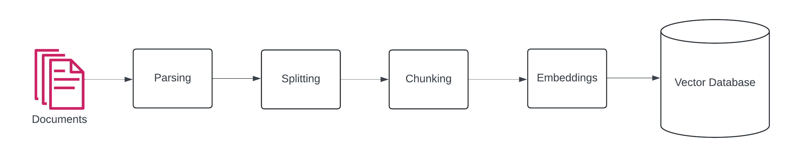
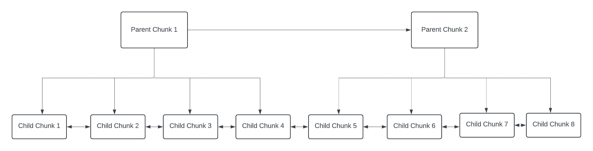
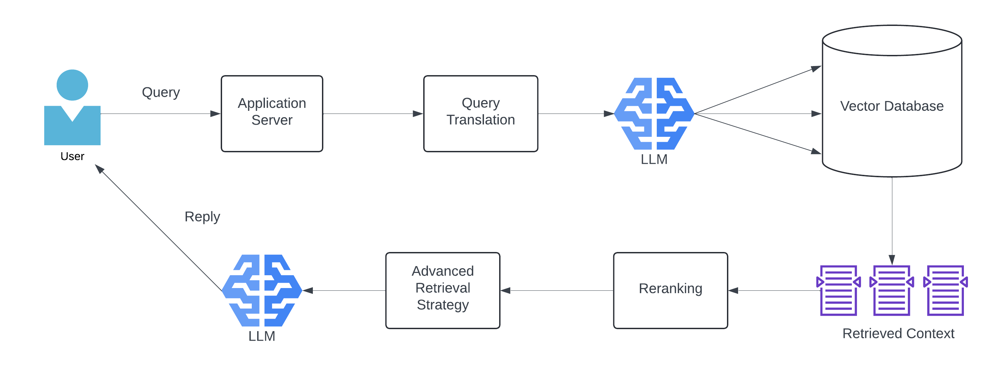
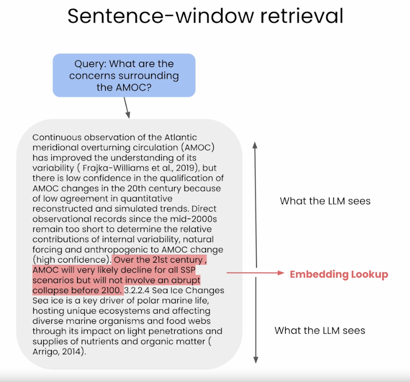
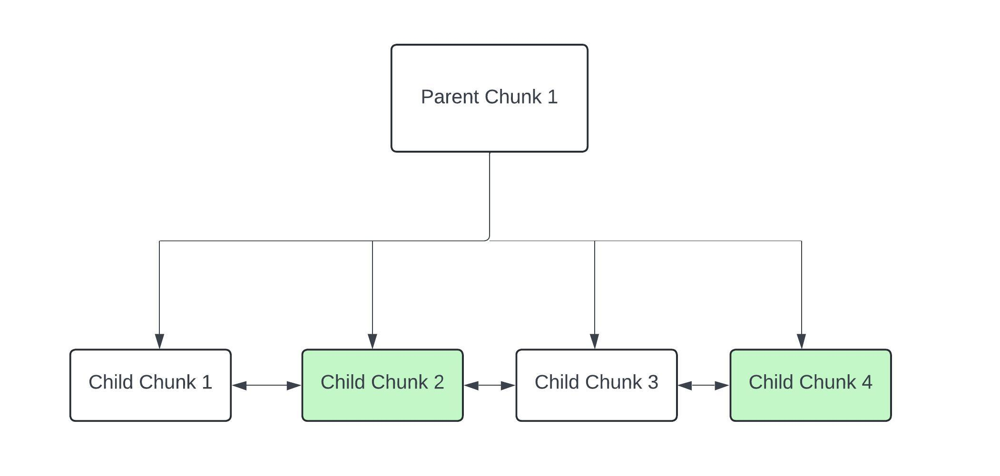

# Document question, answering and summarizing using LLMs

A fully functional document question-answering & summarization app that uses advanced Retrieval Augmented Generation(RAG) to answer questions about private data.
Everything has been implemented from scratch without using any frameworks.

## Why RAG?

Using tools like ChatGPT and Gemini is nice. **But what most companies want is, a way to use Generative AI on some proprietary data.**
Uploading tons and tons of files into the chat window of ChatGPT is not a viable solution. Your data could be at risk!

Enter RAG. A clean way of using Generative AI over proprietary and "moving" data. 

## Details of RAG pipeline

RAG is split into 2 phases : 
- Ingestion
- Query

## Ingestion phase

First, let's talk about the document ingestion pipeline.

### Documents

The term "Documents" here means whatever data you would like to do RAG over. This could be documents like pdf, docx etc or something else like webpages.

### Parsing

This is the first step in our RAG pipeline. Before we attempt to make sense of the data, we need to make sure it's clean and in an easily readable form.
With respect to PDFs : What happens to tables in the documents? What happens to images? Do we need all sections of the PDF? 
All of these things are taken care of in the parsing stage.
In this application, PDF parsing is implemented using [Llamaparse](https://www.llamaindex.ai/blog/introducing-llamacloud-and-llamaparse-af8cedf9006b).

### Splitting

Now, we have the data in a readable format. What do we do this data?
- One option would be to store the entire document as 1 record. This has a few problems:
  - What if the document is 100 pages long? No embedding model can fit this much text into it.
  - Let's say, even if we are able to create an embedding, there is too much information in the entire document to get precise pieces of context during retrieval.
  - The more information we pass onto LLM, the slower the response.
- The other alternative is to split the document into many parts and store these parts as separate entities. This has advantages.
  - Context length is manageable.
  - Retrieval will be more precise.

The question is, how do we split our documents? Here are some options implemented in this application.
- NaiveTextSplitter - This splits the text by whatever character is given as input. Most example is a period `.`.
- RecursiveTextSplitter - This splitter recursively splits the text by paragraphs, new lines and periods until the chunk size is small enough.
- MarkdownSplitter - Especially optimized splitter for markdown files.
- AI21_Splitter - Developed by [AI21 labs](https://www.ai21.com/). This does semantic splitting. It takes in the document as input, brings all the semantically similar parts together and breaks down the text.

For all of the splitters, a `chunk_size` and `chunk_overlap` can be given.

### Chunking

At this stage, all our text is split into small pieces. Neat!

The easiest thing to do right now would be to create a vector for each piece of text and store (string, vector) in a vector database.
This is not a bad option(I did precisely this at the start). But it has some drawbacks.
- What if we want to store some metadata along with the piece of text?
- Storing just the (string, vector) pair will not allow us to use fancy retrieval strategies to improve our context(explained below).

So, we create 2 structures here : 
- **Child Chunk** : This data structure contains a piece of text and information about the previous piece of text, the next piece of text and a `parent_id`. It also has mapping to the user and document from which this chunk was created.
- **Parent Chunk** : A parent chunk contains number of children, concatenated text equal of it's child chunks, next and previous parent chunk.

As the picture shows, the chunks are linked to each other by a doubly linked list data structure. All those years of leetcode, finally useful :)

### Embeddings / Indexing

Once we have our chunks created, we need to be ready to index our data. Generally, there are 3 ways to do this.
- Keyword indexing : In this process, we would split the text and create TF-IDF sparse vectors. We would generally store these in something like Elasticsearch, Solr or OpenSearch. This is explained in depth in my information retrieval and search tutorial [here](https://github.com/ujjwalm29/movie-search). 
- Semantic indexing : Keyword indexing relies on keywords matches with the query. Sometimes, we want to search by the "meaning" of the query text. This is when we use semantic indexing. We feed our text to large AI models that output a large dimensional vector for our text. During query time, we create embedding for the query. The query vector is compared to the indexed vector and the ones which are most similar(lowest cosine distance) are picked. 
- Hybrid Indexing : This is basically a mix of keyword and semantic indexing.

For this application, I am using hybrid indexing.

To create vectors, this tool supports 2 methods :
- HuggingFace sentence-transformers : Vectors are created on device using open source hugging face sentence-transformers library.
  - Advantages : Open source - hence free, the model is downloaded so you're in control
  - Disadvantages : Need decently powerful machine to create great vectors
- OpenAI Embeddings : Vectors created through REST APIs
  - Advantages : No need to own powerful machine, everything is through API
  - Disadvantages : Costs money(not very much); if there is API outage, app is at risk; OpenAI could stop supporting a model

### Vector Database/Database

After doing all of the above tasks, we are FINALLY ready to push our data into a database.

A vector database is a database that is optimized for storage of vectors/embeddings. These optimizations are discussed in depth in my information retrieval and search tutorial [here](https://github.com/ujjwalm29/movie-search). 
Just a heads up : The lines between a "regular" database and a vector database are blurry. People like to pretend a vector database is a whole new thing, but it's not.
Nowadays, more traditional SQL databases like PostgreSQL have a column type for vectors. Traditional search databases like Elastic, Solr etc are now optimized for vector search as well.

For this application, I am using Weaviate to store data.

**Now, our data is neatly stored and ready to be queried in all sorts of ways!**

## Query phase

Let's talk about the query pipeline.

For the purpose of explaining each section, let's assume a document about fruits is indexed into the DB.

### Application Server

This is a basic application server created using FastAPI. Handles incoming files, queries etc.
Eventually will include general application logic like authentication, sessions etc.

### Query Translator, Vector Database

Let's say a child is using our application. They want to know why should we eat apples. But they are a child. So they enter the query "why eat apple?".

Now, if we try to do retrieval using the given query, we might get decent results.
But wouldn't queries like "Why should we eat apples?", "What are benefits of eating apples?" and "What are the advantages of eating apples?" perform better?

This is exactly what a Multi Query translator does. It takes a query, generates alternate queries as per the provided prompt(hence, application specific!).

Once we generate multiple queries, we do a retrieval for all of them. To the results, we apply [Reciprocal Rank Fusion](https://learn.microsoft.com/en-us/azure/search/hybrid-search-ranking).
This gives us the final result set. This final set is passed on to the next stage.

If you're a software engineer, you might be thinking "isn't this hella slow?". Yes, it is. But we can do things to speed it up :
- Generate few alternate queries. Maybe 2 or 3. 
- Use a fast, low-latency LLM, even if it's a little less accurate. I am using Meta AI's Llama 3 8 billion parameter model through [Groq](https://groq.com/) inference API. It's super fast(80 tokens/sec!!!!) and super good(and free lol).

FYI, a SimpleQueryTranslator is also implemented to not do any query translations and use the query directly to get results.

### Reranking

This is an optional step. [Cohere AI](https://cohere.com/) has a neat reranking model available through API. 
If you are a big consumer company, you probably have a ML model specifically for ranking. You could use that here. 

Reranking can be used to get better context for our upcoming phases.

### Advanced Retrieval Strategy

As input, we have a list of `N` chunks ranked from 1 to N.

Now, we could use these chunks as our final context. But that's not optimal. Let me explain why, by referencing the Splitting and Chunking sections above.

See, if we create chunks with a lot of text, we improve recall but reduce precision of our retrieval. This is because a larger piece of text has higher chances of containing lots of important terms.
If we create chunks with little bit of text, we definitely increase precision of our retrieval. But the chunk obtained from the retrieval will have limited amount of information, since it's a relatively small piece of text.

**This is where Advanced Retrieval Strategies are used**. Advanced retrieval strategies help us keep a high level of precision, but ensure that enough context is passed to the next stage for answer generation.

There are 2 Advanced retrieval strategies implemented in this application.

- Sentence Window Retrieval
Let's say we get a sentence at position X in the document as one of our retrieved pieces of context. 
If you think about it, it's probably likely that sentences at position X-1 and X+1 are related to the sentence at position X.
Hence, in sentence window retrieval, we take a retrieved chunk, get the sentences before and after it and join all of them in the original order. The window size is governed by the parameter `adjacent_neighbor_window_size`.
For example, if `adjacent_neighbor_window_size` is 2, the sentences X-2, X-1, X, X+1, X+2 are joined.

Picture credits : RAG evaluation using LlamaIndex and TruLens course on DeepLearning.AI

- Auto merging retrieval
This is a tree based mechanism. If you recall(pun intended), we had child chunks and parent chunks.
Let's say a situation like the below image happens.
  

Child chunk 2 and child chunk 4 are part of the retrieved context. If you think about it, wouldn't it make sense that parent chunk 1 contains all the relevant text required. 

That's what we do. Whenever we see that any parent node has greater than or equal to 50% of it's child nodes included in the final context, we replace all of the child nodes by the respective parent node.

Advanced retrieval strategies were my favorite part to implement!

### Final Generation

In this phase, we receive a final set of context. To generate the final answer, we pass on the context to a LLM and ask it to generate an answer which is grounded in the context.
The main thing required for this operation is good prompt engineering skills.
The prompt needs to explain correctly what needs to be done. Also, it needs to be short, since a long prompt could increase latency.
OpenAI, Perplexity, Claude, Groq APIs can be used in this application

Aaaand DONE! The RAG pipeline is created and document question-answer is so now possible.

Thanks for reading! I am currently looking for Backend engineer, AI engineering and Applied AI engineering jobs.
Please reach out to ujjwalm29@gmail.com or [LinkedIn](https://www.linkedin.com/in/ujjwalm29/). Thanks! 

FYI, this is work in progress so stay tuned for updates and more features!

## Tasks and General Notes (Just for developer - feel free to skip :))

- Modularize Code ✅
- Introduce classes ✅
- Integrate other LLMs ✅ (OpenAI, Claude, Perplexity added. Gimme $5 I'll add Gemini as well)
- Improve Parsing.
  - Parsing instructions in LlamaParse? ✅ (Custom instructions in LlamaParse work exceedingly well!)
  - User is probably ok in waiting for a few extra seconds to ingest data ✅ (LlamaParse custom instruction takes care of this)
  - For research paper indexing, the references can be avoided while indexing ✅ (LlamaParse custom instruction takes care of this)
  - Add option to use pypdf instead of Llama Parse. Will reduce external dependency.
- Chunking (Or text splitting)
  - Different Characters. ✅ (Using a fullstop(period) is the only one that makes sense. Not good kinda lame)
  - MarkdownSplitter by Langchain ✅ (Seems to be working the best. Play around with chunk_size to get good results)
  - RecursiveSplitter by Langchain ✅ (Works pretty well. General advise seems to be to use this by default.)
  - [Other Langchain Splitters](https://api.python.langchain.com/en/latest/text_splitters_api_reference.html)
  - AI21 chunker - This is a semantic text splitter available through API. ✅
    - Notes : 
      - The original ordering of the document is lost(which is ok, I guess).
      - The chunk size is only useful when the chunk size created is smaller than the chunk_size entered as the parameter. In my experience, this is not very useful as I usually want more precision-hence smaller chunks, combined with sentence window retrieval.
      - Sentence window retrieval means something entirely different for this chunker. It still works decently since you can expect some related text around the selected text. But not always the case. 
    - Pros :
      - It does a good job of semantically chunking text.
    - Cons :
      - External Dependency. Always gotta be a bit careful with those.
  - A big brain move - Use LLM for summarizing and chunking the text. Probably turns out to be expensive but data quality would be MUCH better. 
    - Could be effective with 7B param LLMs deployed on prem(No API business).
    - Context window sizes will be a problem.
  - Some other heuristic splitters.
- Context Retrieval Strategy
  - Challenge : Create a chunking + storage strategy that is agnostic of retrieval strategy and storage medium(vectorDB, localStore).✅
    - Challenge Accepted : Created POC of a linked list based Parent and child object store. Implemented Auto Merge Retrieval and Sentence Window Retrieval. POC is [here](https://github.com/ujjwalm29/pdf-reader/blob/main/ingestion/chunking/ChunkingController.py).✅   
  - Basic Context Retrieval ✅
  - Sentence Window Retrieval ✅
  - Auto Merging Retrieval (Tree Based) (Implemented using chunking+storage strategy)✅
- Core Retrieval
  - Embeddings
    - Create Embeddings locally ✅ - HuggingFace sentence-transformers library
    - Create embeddings through API ✅ - OpenAI embeddings supported.
    - Store embeddings efficiently.
    - Advanced retrieval techniques (IVFOPQ, int8 vectors, binary quantization) ❌- Not really needed here. Examples available in [my retrieval guide.](https://github.com/ujjwalm29/movie-search/tree/master/level_6_faiss_IVFOPQ_HNSW)
    - Adaptive retrieval using Matryoshka Representations.❌- Not really needed here. Example given in my [medium](https://ujjwalm29.medium.com/matryoshka-representation-learning-a-guide-to-faster-semantic-search-1c9025543530) article.
  - Integrate Vector DBs. ✅ - Added Weaviate. About to get Vectara credits, will add soon
    - Issue ❗- Need to build an abstraction such that getting results from database or pkl file should be easily swappable. ✅ - DONE
    - Issue ❗- Need to convert chunking strategy into an abstraction and implementable for dataframe, vector DB etc ✅ - DONE
  - Use Hybrid search ✅ - Through weaviate. Abstraction pending
  - Option for attaching Postgres/Elasticsearch(or Solr, Opensearch etc) instance for search.❌
    - Is it possible to do search using SQL? [Levels.fyi did it](https://www.levels.fyi/blog/scalable-search-with-postgres.html)
    - MOST people usually move things to Elasticsearch for keyword search.
    - Hence, if you're using SQL, move data to a search engine(like Solr etc) which can do good hybrid search.
    - I am aware of Elasticsearch basics, will add Elasticsearch integration
  - Design Flaw Maybe: In the storage class, a lot of if conditions getting created on the basis of index_name(parent, child). Is there a way to unify in 1 single index? ✅
    - The child chunk and parent chunk classes have been unified in the branch `schema_change`. But there are a few issues :
      - If you put everything into 1 index, then parent chunks become part of the search. This is unnecessary and will affect performance.
      - An option would be to add a Filter on the chunks with 0 children and then do a search. That would add unnecessary overhead as well.
- Features 
  - Multiple PDFs (should be easy, just repeat everything for each file) ✅ - Call the API/function
- Deployment and Productization 
  - Logging using loggers and NOT print statements. ✅ - `INFO`, `DEBUG` and `WARN` logging added 
  - Create APIs for operations
    - Add document - ✅
    - Search - ✅
    - Delete Indexes - ✅
    - Add auth
      - Added hacky API key based auth - ✅
    - Remove document?
      - Each doc indexed needs to have an ID. Each chunk needs a doc ID. Enter doc ID to delete - ✅
  - Create Streamlit UI
  - Storage should be a singleton dependency - ✅
  - Deployment stuff
    - Docker  ✅
    - docker compose  ✅
  - What if multiple users use it?
    - Added user_id to the schema - ✅
  - Tests :(
  - Error Handling
- PI removal 
- Evaluation using Tru Lens
- Multi-Query(Query Expansion)
  - Old school, semantic Knowledge graphs created using SpaCy or leveraging inverted+forward index.
    - Can create alternate words, but how to create sentences?
  - Using LLMs : Feed the query to an LLM, ask it to expand on it and give 3 alternatives. Search and aggregate results.
- Summarization pipeline
  - Sometimes, people just want summaries of pdfs.
  - Use OpenAI GPT 4 Turbo with batch functionality
    - Store the file in OpenAI storage
    - Create a batch with summary prompt - Store the batch ID somewhere
    - Create a cron job like process(is that a webhook?) to check whether job is complete.
    - Store summary in separate index with doc_id as key.
    - Find a way to decide whether user is asking for summary or a specific question. (Use an LLM?)
- How does one build a chat interface over RAG?
  - Let's say, I ask a question and get an answer. What's next?
  - Is the next prompt considered a new question? Do we do retrieval -> generation?
  - What if it's a follow up to the answer? Like "explain the previous answer like I'm 5"?

## Articles/Libraries to write?

- Build a proxy for multiple LLM API providers?
- How to use llama parse effectively?
- A guide to chunking strategies
- Write about chunking POC.
- Write about each section
- 